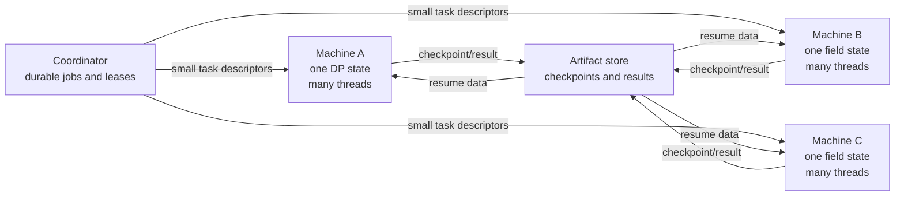

# Distributed computation design

> **Design pitch (2026-09-28).** The system that was built differs in places; see [../cluster/DESIGN.md](../cluster/DESIGN.md), [QUEUED_TILES.md](QUEUED_TILES.md) and [CONTINUOUS_CAMPAIGN.md](CONTINUOUS_CAMPAIGN.md).

This document proposes an architecture for computations too large for one
machine. It is a design pitch, not an implementation plan carved in stone. The
frozen compatibility fixtures remain under [`examples/`](../examples/); their formats and
small independent verifier are useful reference points, but the production
solver will need different data structures and algorithms.

In this design, **merlin** is the physical leader at `192.168.4.151`. Its current
installed system still reports the hostname `uther` because that SSD was moved
from the former machine. Treat `merlin` and `uther` as aliases for the same node
until the hostname is changed.

## Main idea: one resident field per machine

A machine assigned to a field attempt builds that field exactly once. One
long-lived **field owner** process holds its immutable field representation,
special-set index, and graph metadata. A pool of local worker threads operates
against that shared address space. This follows the useful part of
`multiclimb`: large state is allocated once and parallel workers receive ranges
or small task descriptions rather than private copies.

Machines cannot share ordinary RAM. A second machine working on the same field
would necessarily hold another copy, or repeatedly fetch pieces over the
network. Therefore the default unit of placement is:

> At most one active field attempt per machine, with all cores on that machine
> sharing its resident state.

The coordinator may still split one mathematical calculation across machines.
It assigns each machine a different shard, frontier, or checkpoint-derived
state. Each assigned machine constructs only the field needed by its current
attempt. Large field arrays never travel through the coordinator.

## Separate the DP and matching campaigns

The DP result remains a dependency of matching, as in the proof of concept.
The distributed system treats them as different job types because their state,
parallelism, and certificates differ.

### Distributed DP

The recurrence has dependencies from `(u,v)` to smaller coordinates. A simple
distributed implementation would communicate too much if it assigned individual
cells. Work should be tiled into rectangular blocks and processed in dependency
waves. A tile owner receives the boundary values it needs, fills a large local
tile with many threads, and writes a compact tile checkpoint containing:

- the tile coordinates and recurrence version;
- its completed values;
- chosen transitions needed for reconstruction;
- hashes of all predecessor tiles;
- value type and overflow bounds;
- checksum and solver provenance.

The coordinator releases a tile only after all predecessor tiles are durable.
Within a machine, threads share the tile and precomputed transition/gain table.
No thread keeps its own DP matrix. Tile dimensions are chosen from available
RAM and cache size, and should be much larger than a network message.

The full square table may still be the wrong algorithm at very large budgets.
Before committing to distributed storage, investigate whether dominance,
symmetry, sparse reachable states, or a frontier formulation can reduce the
state space. Distribution cannot rescue an asymptotically unmanageable table;
it only spreads its cost.

Reconstruction follows stored choices from the final cell across tile
boundaries. The final compact DP artifact contains the ordered split and optimum,
not every tile. An independent verifier may recompute small cases. For enormous
cases, an optimality certificate or a second implementation that checks tile
recurrences and dependency hashes will be needed; a feasible split alone does
not prove optimality.

### Distributed matching

The graph should remain implicit. A field owner stores the polynomial, exponent
label mapping, prefix/suffix classification, and any compact lookup tables that
profiling justifies. It must not allocate all edges. A neighbor is derived from
`(coset, prefix, suffix, neighbor_index)`.

Inside one machine, use a parallel matching engine over shared arrays:

- one resident field and immutable graph description;
- shared `pair_left` and `pair_right` arrays;
- thread-local queues and scratch buffers;
- coarse phases or carefully partitioned ownership to avoid fine-grained locks;
- deterministic checkpoint boundaries, even if scheduling inside a phase is not
  deterministic.

The first production candidate should be a level-synchronous Hopcroft-Karp
variant: parallel BFS constructs alternating levels, then parallel DFS or
augmenting searches claim disjoint endpoints. Correctness is more important
than lock-free cleverness. Every phase records matching cardinality and a
monotone progress counter.

Splitting a single matching across machines is substantially harder because an
augmenting path crosses partitions. Static independent partitions are not
generally correct. Two plausible later designs are:

1. **Central matching state, remote neighbor scans.** One machine owns the
   matching arrays; other machines scan assigned left ranges and return compact
   candidate/frontier batches. This conserves field RAM per worker but puts the
   matching arrays and synchronization bottleneck on one owner.
2. **Partitioned matching with bulk-synchronous phases.** Each machine owns a
   range of left vertices and a range of right vertices. Alternating-frontier
   messages cross owners between barriers. Endpoint ownership serializes claims.
   This is scalable in principle, but failure recovery and proof of maximality
   are much more complex.

Begin with single-machine-per-field matching using all local cores. Add
cross-machine matching only when measurements show that a real target cannot
fit or finish on the largest node. The protocol boundary should anticipate it,
but the first implementation should not pretend the algorithms are equivalent.

## Memory layout on a field machine

The field owner builds state in stages and reports an estimate before committing:

| State | Sharing and storage |
| --- | --- |
| Polynomial and parameters | Tiny, immutable. |
| Exponent/basis conversion | One packed array per direction if both are demonstrated necessary. |
| Prefix/suffix membership | Prefer a formula or compact permutation/index over lists of objects. |
| DP split and coset metadata | Tiny and immutable. |
| Matching arrays | Shared mutable arrays, sized by left and right vertex counts. |
| Search scratch | Per-thread bounded buffers, accounted separately. |
| Checkpoint image | Streamed to disk; do not duplicate the full live state in RAM. |

Use file-backed `mmap` for very large restartable arrays when measurements show
it helps. Anonymous shared mappings like `multiclimb` are useful for forked
processes, but threads naturally share memory and avoid copy-on-write surprises.
Prefer threads for the field solver unless process isolation proves valuable.
NUMA-aware first touch and fixed thread affinity matter on large machines.

### Processor affinity

The node agent discovers Linux CPU topology from sysfs and assigns every solver
an explicit CPU set. The solver applies process affinity before allocating large
state, pins each worker thread to a specific logical CPU, and first-touches its
working ranges from the thread that will use them. Affinity is mandatory for
production runs but may be disabled explicitly for debugging.

Thread placement fills one hardware thread on each physical core before using
SMT siblings. Benchmarks may override that order for a particular solver phase,
because DP, field construction, and matching can have different memory-bandwidth
and latency behavior. The agent never assumes that adjacent Linux CPU numbers
are separate physical cores; it uses package, core, and sibling identifiers.

A task record stores the assigned CPU list and detected topology. A resumed task
may use a different assignment without changing its mathematical identity, but
performance records retain both assignments. The solver must fail clearly if it
cannot apply the lease's CPU set rather than silently oversubscribing another
calculation.

On merlin, reserve one complete physical core, including both SMT siblings, for
the coordinator, node agent, storage service, and ordinary OS work. Its other
seven physical cores, fourteen logical CPUs on the current processor, are
available to solvers. Worker-only nodes do not dedicate a physical core to the
lightweight agent initially; solver thread counts and SMT use remain adjustable
from the leader and will be chosen from benchmarks.

The node agent admits one field only if the field estimate plus matching state,
scratch space, and an OS reserve fit. It does not start a second field merely
because a few cores are idle. Small utility jobs may run only within an explicit
memory reserve.

## Job and task hierarchy

A durable central database records four levels:

1. **Calculation:** prime power, algorithm version, and requested result.
2. **DP job:** recurrence parameters and the identity of its final DP artifact.
3. **Field attempt:** DP identity plus one primitive polynomial and fixed
   conventions. Polynomial-dependent failures remain separate attempts.
4. **Task/phase:** a retryable tile, matching phase, scan range, checkpoint, or
   verification action belonging to one job or attempt.

IDs are hashes of canonical specifications where possible. A retry creates a
new attempt record while retaining the same logical task identity. Results are
immutable. Duplicate late completions are checked and retained as provenance;
they never silently overwrite a verified artifact.

The scheduler uses two placement modes:

- **Exclusive field lease:** reserves a machine for one field attempt and sends
  phase/range work to its resident owner.
- **Distributed calculation lease:** groups multiple machines under one DP or
  matching calculation, with explicit ownership of tiles or partitions.

The first mode is the default. It directly enforces the one-field-per-machine
memory rule.

## Checkpointing and failure recovery

Checkpoints occur at algorithmically consistent boundaries:

- after a completed DP tile or dependency wave;
- after a completed matching BFS/augmentation phase;
- after a durable Hall witness or complete matching is formed.

The coordinator exposes a configurable checkpoint interval, initially **30
minutes per calculation regardless of machine count**. It requests the next
safe checkpoint early enough to account for measured serialization and upload
time. Algorithmic boundaries remain authoritative: the solver never writes an
inconsistent checkpoint merely to meet the target. If no safe boundary can
satisfy the interval, status reports the excess and the algorithm needs a finer
resumable boundary. This interval deliberately supersedes the earlier aggregate
one-machine-hour loss budget.

A checkpoint is written to a new local file, checksummed, atomically renamed,
and queued for central upload. Only after central durable acknowledgment may an
older checkpoint be retired. Checkpoints include the calculation ID, field
polynomial, DP artifact hash, algorithm/build version, phase number, array
dimensions, matching cardinality, and hashes of streamed state chunks.

After a worker crash, the local supervisor restarts the field owner from the
latest validated local checkpoint. After a machine disappears, its lease
expires and another suitable machine downloads the latest central checkpoint,
rebuilds the immutable field, and restores only the mutable algorithm state.
This deliberately avoids storing an extra full field image in every checkpoint.

A matching checkpoint must describe a valid matching. Work in an interrupted
phase is discarded unless its protocol defines a transactional phase commit.
That keeps recovery simple and makes correctness inspectable.

## Network protocol

Use a small versioned protocol over authenticated TLS. HTTP with a compact
binary body is sufficient initially; a custom transport is unnecessary. The
control path carries specifications, leases, heartbeats, counters, and hashes.
Large checkpoints and artifacts use chunked, resumable upload/download directly
to storage nodes selected by the coordinator.

### Distributed artifact storage

Bulk files are content-addressed and distributed across worker disks. Placement
uses free space, current disk/network load, and failure state rather than simply
filling the node that produced a file. Compute admission reserves disk and I/O
capacity for this storage role, and checkpoint transfers are throttled so they
do not starve an active solver.

Use two replicas for large resumable checkpoints. A checkpoint may be advertised
as durable only after two distinct nodes acknowledge and re-hash it. Use three
replicas for the much smaller final DP, matching, polynomial-failure, and
verification artifacts. Replicas must reside on different machines. Rebalancing
restores the target count after a node is lost or a disk approaches its reserve.

Merlin, currently reporting the hostname `uther`, keeps the authoritative
index of artifact hashes, sizes,
types, calculation and attempt IDs, replica locations, verification state, and
reference counts. Each storage node also keeps an append-only local manifest of
the blobs it holds. The index database is backed up as a content-addressed
artifact and can be reconstructed by collecting and validating node manifests;
the metadata host is therefore a service-availability dependency but not the
only record of file ownership.

Garbage collection is mark-and-sweep from immutable run records. It never
deletes the final artifact of an earlier run merely because a later run has the
same calculation specification. Checkpoints may be retired only after a newer
checkpoint is durable and no retained run references them.

Never send individual graph edges or DP cells as ordinary network RPCs. Batch
communication by tile, range, or phase. A node may continue the current bounded
phase through a short coordinator outage, but it must not begin another phase
without a renewable computation lease.

## Scheduling large and small work

Maintain separate estimates for field-build time, resident bytes, DP work,
matching work, checkpoint bytes, and verification work. Calibrate estimates
from completed attempts. Schedule short independent calculations first for
early table coverage, while reserving a configurable fraction of machines for
long-running work so large entries do not starve forever.

Manual submissions enter the same queue with an optional priority. A manually
pinned polynomial remains pinned. An automatic field attempt tries primitive
polynomials in a deterministic order, saving every certified obstruction and
linking the first later success. Encountered failures are documented; the
scheduler does not run a separate hunt for them.

An ordinary duplicate submission attaches to or returns the existing logical
calculation. `--rerun` instead creates a new immutable run/attempt ID and starts
without solver checkpoints or mutable state from earlier runs. It may reuse
immutable mathematical inputs such as a verified DP artifact only when the
operator has not requested that stage itself be recomputed. A rerun never
replaces or deletes an earlier run; status and inspection group the attempts for
comparison. An explicit `--from-scratch` recomputes every requested stage while
retaining all previous artifacts.

## Operator control and node health

`kh stop --all` first persists the stopped generation at the coordinator. Node
agents acknowledge it, stop dispatching, request a checkpoint at the next safe
boundary, and terminate solver process groups after a bounded grace period.
The stopped generation disables heartbeat escalation, so an intentional stop
does not restart the agent or machine. `kh resume --all` advances the control
generation and grants fresh computation leases.

Recovery uses heartbeats rather than a hardware watchdog. During active work,
the solver publishes a monotonically increasing progress heartbeat to its node
agent, and the node agent publishes its own heartbeat to the coordinator. The
two levels distinguish a stalled calculation from a dead agent:

1. If solver progress stops, the node agent terminates the solver process group
   and restarts it from the latest valid checkpoint.
2. If the agent heartbeat stops, the coordinator attempts to restart the agent
   through SSH/system service control and waits a fixed recovery grace period.
3. If the agent still does not recover, the coordinator records a reboot attempt
   durably and invokes the lab.s working `restart` shell command over SSH.
4. A machine is rebooted at most once for one incident. If it fails to return
   after that reboot and boot grace period, it is marked unavailable and its
   lease is reassigned. No automatic second reboot is permitted.

The coordinator must persist the incident ID and `reboot_attempted` flag before
issuing `restart`; otherwise a coordinator crash could accidentally allow a
second reboot. A successful agent heartbeat closes the incident only after the
agent reports its boot identity and reconciles any local checkpoint/outbox.

An agent cannot reliably restart itself after it has stopped, so systemd and/or
the coordinator is the external supervisor for the agent process. Likewise, an
SSH restart is possible only while the machine is reachable enough to accept
the command. A completely unreachable or frozen machine is marked unavailable
and its work is recovered elsewhere. Loss of coordinator connectivity alone
does not cause a node reboot: the node finishes at most its current bounded
phase, stops when its computation lease expires, and waits.

Status reports healthy, stalled, restarting-agent, rebooting-once, unavailable,
and intentionally-stopped states. This prevents an unreachable machine from
being reported as stopped or recovered without evidence.

## Verification boundary

The production solver is not its own authority. It emits compact artifacts and
checkpoints; a separate verifier checks:

- the primitive-X field convention and prefix/suffix rule;
- the exact DP recurrence, choices, and claimed optimum or its distributed
  recurrence certificate;
- every selected matching edge and uniqueness of right endpoints;
- every Hall witness by reconstructing its complete neighborhood;
- artifact dependencies, checksums, dimensions, and version identities.

Verification can itself be distributed by ranges, but a small final reducer
must combine range claims without trusting a worker's summary. Successful
verification produces a new signed/hashed verification record rather than
mutating the solver artifact.

DP results use a fixed tie rule and are reproducible. Parallel matching may
produce any complete valid matching; matching artifacts do not need to be
byte-identical across runs. Artifact specifications and verification are
deterministic, and the independent verifier accepts every witness satisfying
the construction.

## Suggested implementation sequence

1. Preserve the proof of concept and freeze its examples as compatibility tests.
2. Write a production field library with compact arrays, memory estimates, and
   deterministic reconstruction; benchmark one resident field with many threads.
3. Implement local tiled DP and local parallel matching with phase checkpoints.
4. Add the node agent and coordinator for whole independent jobs and exclusive
   field leases.
5. Add DP tile distribution, because its dependency structure is clearer and
   easier to verify than cross-machine augmenting paths.
6. Measure the largest target on the largest node. Implement cross-machine
   matching only if local shared-memory matching is insufficient.
7. Add automatic retry across primitive polynomials, central review, heartbeat
   recovery, the one-reboot incident policy, global stop/resume, and manual
   submission.

This sequence exercises the core premise early: one field resident per machine,
all local cores sharing it, and only compact specifications/checkpoints crossing
the network.

## Decisions still needed

- Whether nodes share a filesystem or require an object store on the coordinator.
- Local checkpoint disk budget and centrally durable storage location.
- The threshold that justifies cross-machine matching instead of assigning one
  field to the largest available node.

The machine inventory is complete in [`../inventory/CLUSTER_INVENTORY.md`](CLUSTER_INVENTORY.md).
Hardware-watchdog support is no longer a prerequisite; the agreed recovery
policy uses solver/agent heartbeats, one agent-restart attempt, and at most one
machine reboot per incident.
 
The workload is open-ended until the publication deadline and is ordered by
increasing estimated runtime. Initial integer bounds, a 4096-cell tile side,
memory admission rules, and progress timings are specified in
[`RESOURCE_MODEL.md`](RESOURCE_MODEL.md).
